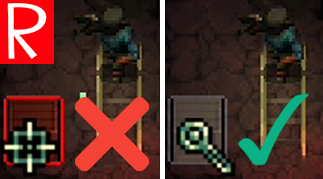

# Quasimorph Don't Shoot Boxes

# Configuration
Didn't mean to shoot those wooden boxes at point blank range with your rocket launcher?

This mod changes the default action for wooden boxes from shoot to search.

To shoot the boxes, the player must hold down the shift key.
Note that despite the search icon, the wooden boxes cannot be searched; instead, they drop items when destroyed.

# Buy Me a Coffee
If you enjoy my mods and want to buy me a coffee, check out my [Ko-Fi](https://ko-fi.com/nbkredspy71915) page.
Thanks!

# Credits
[Validate icons created by meaicon - Flaticon](https://www.flaticon.com/free-icons/validate)
[Close icons created by Pixel perfect - Flaticon](https://www.flaticon.com/free-icons/close)

# Source Code
Source code is available on GitHub at https://github.com/NBKRedSpy/DontShootBoxes
